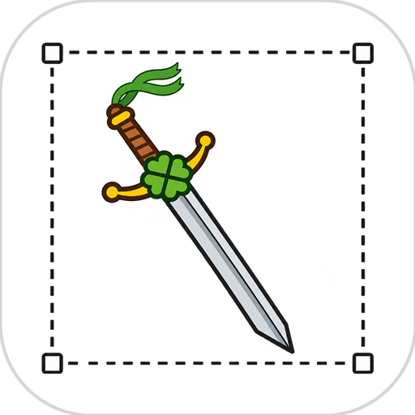

<div align="center">
  
  <h1>CloverViewer-Tauri — オープンソース Windows 画像ビューア &amp; スクリーンショットツール（Tauri 2）</h1>
  <p>
    <a href="README.md">中文</a> · <a href="README.en.md">English</a> · <b>日本語</b>
  </p>
  <p>
    画像閲覧とスクリーンショット注釈をひとつにまとめた、無料・軽量な Windows アプリ —— <a href="https://tauri.app">Tauri 2</a> で再実装した <a href="https://github.com/smallclover/CloverViewer">CloverViewer</a>（Rust + egui）。<br>
    Rust バックエンド + Web フロントエンド（Vite + TypeScript）、内蔵 <a href="https://modelcontextprotocol.io">MCP Server</a> 付き。
  </p>
  <p>
    
    <a href="LICENSE"></a>
    
    
    
  </p>
  <p>
    <a href="https://github.com/smallclover"></a>
    <a href="https://smallclover.github.io/CloverViewer-Tauri/"></a>
  </p>
</div>

---

## 📖 はじめに

CloverViewer-Tauri は、**Tauri 2** で構築された**無料・オープンソースの Windows 画像ビューア & スクリーンショットツール**です。本来の [CloverViewer](https://github.com/smallclover/CloverViewer)（egui/eframe 版）の**次世代の再実装**で、**UI を全面的に刷新**しました——従来の Rust ネイティブ egui インターフェースから、Web（Vite + TypeScript + Canvas）ベースのモダンなカスタム・フレームレスインターフェースへと一新されています。見た目も操作感も新しくなりました。機能を揃えたうえで、**内蔵 MCP Server** を追加し、Claude Desktop などの AI クライアントがスクリーンショット機能を直接呼び出せるようにしています。軽量で高速、画像閲覧・マルチモニターキャプチャ・注釈・OCR をひとつのポータブルな Windows アプリに収めています。

## 🎯 こんな用途に

*   **標準の画像ビューアを置き換えたい**: 無料・オープンソース・広告なし・同梱物なし、アカウント登録も不要。
*   **ドキュメント作成や不具合報告でよくスクリーンショットを撮る**: マルチモニター対応に加え、矩形・楕円・矢印・ペン・モザイク・テキストの注釈、Enter でコピー。
*   **長いスクリーンショットが必要**: チャット履歴、Web ページ全文、長いリスト、ログ、コードの差分を1枚の長い画像に結合。
*   **画面から文字を抜き出したい**: Windows ネイティブ OCR で中国語・英語・日本語に対応。どこにもアップロードしません。
*   **AI に画面を見せたい**: 内蔵 MCP Server により、Claude Desktop などの MCP クライアントがディスプレイ一覧・撮影・文字認識を直接呼び出せます。

## ✨ 機能

### 🖼️ 画像ビューア

*   **2つの表示モード**: グリッド表示（サムネイル）と単一画像表示（大画面）を切り替え
*   **大きなフォルダーでも快適**: グリッドの仮想スクロールに加え、サムネイルの同時処理数制限・重複リクエストの統合・キャッシュを使用。表示範囲から外れた待機中の処理は省略します
*   **フォルダー閲覧**: フォルダーを開くと全画像を自動読込。並べ替えとサムネイルサイズの操作は画像がある場合だけ表示します
*   **すばやいナビゲーション**: ←/→ キーで切替。現在の画像を優先し、隣接画像のプリロード数を制限します。デコード後に滑らかに切り替え、素早く連続操作しても古い選択の画像は表示されません
*   **なめらかなズーム**: ホイールでズーム + ドラッグでパン、ズーム感度を調整可能。ウィンドウに合わせた表示では矢印、ドラッグできる表示では手形カーソルを使用します
*   **ドラッグ&ドロップで開く**: 画像やフォルダーをウィンドウへ直接ドロップ
*   **画像プロパティ**: 名前 / パス / サイズ / 変更時刻 + EXIF（カメラ、ISO、絞り、シャッター速度、焦点距離、レンズ）。保存先フォルダーも開けます
*   **右クリックメニュー**: 画像コピー、パスコピー、表示、画像を編集
*   **LAN 共有**: 画像を右クリックすると一時リンクと QR コードを作成。同一ネットワークの端末でプレビューまたはダウンロードでき、有効期間と一回ダウンロードでの失効は設定で指定できます
*   **回転と反転**: R で回転、H/V で反転
*   **画像編集**: ツールバー・「編集」メニュー・右クリックメニューから開き、切り抜き、回転、注釈（矩形、楕円、矢印、ペン、モザイク、テキスト）、選択削除、元に戻す / やり直す、PNG / JPEG / WebP への書き出しまたは元画像への上書きができます。切り抜きには三分割ガイド、辺と角のハンドル、選択範囲の移動、範囲外のグレー表示があり、下部ツールバーには現在のツールの設定、保存パネルには形式と出力倍率を表示します

### 📸 スクリーンショットと注釈

*   **マルチモニター対応**: 複数画面を跨いで仮想デスクトップ全体を連結キャプチャ。撮影ウィンドウをバックグラウンドで準備し、元の画素を直接転送することで、画質を保ったまま範囲選択画面が表示されるまでの待ち時間を短縮します
*   **スクロール撮影（長い画像）**: スクロールできる範囲を選んだあと、自分のペースでスクロールすると、フレームごとに重なり画素で位置合わせし、検証済みの新しい内容だけを長い画像へ結合します。固定ヘッダー・固定フッター・固定サイドバーは自動で除外。結果はコピー / デスクトップ保存 / ビューアで開くが可能。設定で試験的な自動スクロールを有効にすると、対象アプリが受け付けるスクロール方式（ホイールメッセージ / 疑似ホイール / PageDown / スクロールバー）を判定して自動でスクロールします
*   **注釈ツール**: 矩形、楕円、矢印、ペン、モザイク、テキスト。線幅・文字サイズ・ブロックサイズは元画像のピクセル（px）で個別に指定し、同じセッション内でツールを切り替えても各サイズを保持します。画像編集の初期サイズとプリセットは表示倍率に合わせて調整するため、大きな画像を縮小表示しても注釈が見やすくなります。ウィンドウをリサイズしても選択済みのサイズと既存の注釈は維持されます。スクリーンショットと画像編集では、四隅に円形マーカーのある透明な入力欄を共用し、内容に合わせてサイズが自動調整されます。モザイクはブラシ径のリングを表示し、元画像から取得した固定ブロックを連続して塗るため、マウスを離してもプレビューと同じ仕上がりになります
*   **色と線幅**: ツールアイコンを長押しでカラーパレットを開く
*   **拡大鏡カラーピッカー**: 座標とピクセル色をリアルタイム表示、**Alt+C**（カスタマイズ可）で色をコピー
*   **元に戻す / やり直す**: Ctrl+Z / Ctrl+Y
*   **エクスポート**: Enter でクリップボードへコピー / デスクトップへ保存。ツールバーから通常のスクリーンショットを直接ビューアで開けます
*   **LAN 共有**: 注釈後に一時リンクと QR コードを作成し、同一ネットワークの端末でスクリーンショットをプレビューまたはダウンロードできます
*   **OCR 文字認識**: Windows ネイティブ UWP OCR エンジン（`Windows.Media.Ocr`）ベース、中英日など複数言語対応。グレースケール + 2× ニアレストネイバー拡大の前処理付き。認識後は元画像とコピー・一時編集できる文字をビューアで開きます

### 🤖 MCP Server（新規）

[Model Context Protocol](https://modelcontextprotocol.io) サーバーを内蔵し、スクリーンショット機能を AI クライアントに公開します:

*   **stdio モード**: `CloverViewer.exe --mcp`（単一インスタンスの独立プロセス）
*   **HTTP モード**: `CloverViewer.exe --mcp-http --token <secret> [--port 3000]`（streamable HTTP、エンドポイント `/mcp`、ローカル専用。リクエストには `Authorization: Bearer <secret>` が必要）
*   **ツール**: `list_monitors`、`take_screenshot`、`get_screenshot`、`ocr_screenshot`、`delete_screenshot`。アクティブウィンドウ、指定ディスプレイ、全ディスプレイ、領域のキャプチャに対応し、視覚対応クライアント用の画像コンテンツと構造化メタデータを既定で返します。クライアントが MCP サーバーのローカル ファイルシステムにアクセスできる場合に限り、`delivery: "path"` または `"both"` でパスを要求してください。

Claude Desktop の `claude_desktop_config.json` で接続:

```json
{
  "mcpServers": {
    "clover-viewer": {
      "command": "C:\\Path\\To\\CloverViewer.exe",
      "args": ["--mcp"]
    }
  }
}
```

### ⚙️ システム機能

*   **3言語UI**: 简体中文 / English / 日本語、その場で切替。ページの言語情報も同期し、設定の説明と編集ツールバーは狭いウィンドウに対応します
*   **ライト/ダークテーマ**: システム追従 / ダーク / ライト。設定と画像編集で角丸のドロップダウンを共用し、マウスとキーボードで選択できます
*   **表示倍率**: 既定は 100%。設定 → 一般 → 言語と外観で 110% / 125% / 150% を選ぶと、メイン画面とスクリーンショット画面にすぐ反映され、選択が保存されます。撮影画像の元のピクセル寸法は維持されます
*   **タイトルバーのメニュー**: ファイル（フォルダーを開く）/ 編集（設定）/ ヘルプ（CloverViewer について）。他の場所をクリックするか Esc で閉じます
*   **グローバルホットキー**: デフォルト **Alt+S** でスクリーンショット起動（トレイからも利用可、カスタマイズ可）
*   **システムトレイ**: 閉じる時にトレイへ最小化するかを選択可
*   **自動起動**: `HKCU\...\Run` レジストリを書き込み、`--startup` 引数で静かにトレイへ起動
*   **単一インスタンス**: named mutex で多重起動を防止
*   **設定互換**: egui 版と `%APPDATA%\CloverViewer\config.json` を共用（失敗時は exe の隣へフォールバックしポータブルモード）
*   **デスクトップペット**：Live2D キャラクターを表示し、待機・まばたき・定期的なうなずき・マウス追従に対応します。ドラッグで移動でき、設定の 60%〜200% スライダーで拡大縮小でき、スクリーンショット時は自動で隠れます。右クリックでスクリーンショット、スクロール撮影、メイン画面、終了を選べます。
*   **設定パネル**: カテゴリ + 検索つきの全画面設定（一般 / 表示 / スクリーンショット / LAN 共有 / ホットキー / キャッシュ）で、各項目に説明文付き。言語、テーマ、ズーム感度、デスクトップペットとその倍率、3つのグローバルホットキー、拡大鏡、トレイ最小化、自動起動、ソフトウェア更新、LAN 共有ルールを含みます
*   **一時キャッシュ管理**: 設定 → キャッシュ で `%TEMP%\CloverViewer` の一時ファイル数とサイズを表示し、保持期間（既定は7日、起動時に自動削除）を設定するか、期間を指定して今すぐ削除できます
*   **ソフトウェア更新**: 手動で確認し、ダウンロードの進捗と段階別のエラーを継続表示します。ネットワークのダウンロード失敗は最大3回まで試行し、署名検証に成功してからインストールします

## 🖼️ 対応フォーマット

PNG · JPEG · GIF · BMP · WebP · TIFF

## 🔧 技術スタック

| レイヤー | 技術 |
|---|---|
| フレームワーク | [Tauri 2](https://tauri.app) |
| フロントエンド | Vite · TypeScript · Canvas |
| スクリーンショット | xcap |
| OCR | Windows.Media.Ocr（ネイティブ UWP） |
| MCP | rmcp + axum（streamable HTTP） |
| 画像 | image · imageproc · kamadak-exif |
| システム連携 | global-shortcut · single-instance · tray · winreg |

## 📦 インストール

[Releases](https://github.com/smallclover/CloverViewer-Tauri/releases) から `CloverViewer_x.y.z_x64-setup.exe` をダウンロード（NSIS インストーラー、per-user インストールで管理者権限不要）。ポータブル版 `CloverViewer.exe` も直接利用できます。

## 🛠️ ソースからのビルド

前提: [Rust](https://www.rust-lang.org/tools/install) + Node.js ≥ 18 + WebView2 Runtime（Windows 10/11 に同梱）。

```shell
npm install

# 開発モード
npm run tauri dev

# Debug ビルド
cd src-tauri && cargo build

# Release + NSIS インストーラー
npm run tauri build
# 出力: src-tauri/target/release/cloverviewer-tauri.exe
#        src-tauri/target/release/bundle/nsis/CloverViewer_x.y.z_x64-setup.exe
```

> **中国ネットワーク向け注意（任意）**: 初回の `tauri build` は NSIS ツールチェーンを GitHub からダウンロードします（nsis-3.11.zip + nsis_tauri_utils.dll、`%LOCALAPPDATA%\tauri\NSIS` にキャッシュ）。ダウンロードが詰まったらミラーを設定してください:
>
> ```shell
> # PowerShell（現在のセッション）
> $env:TAURI_BUNDLER_TOOLS_GITHUB_MIRROR = "https://gh-proxy.com/https://github.com"
> npm run tauri build
> ```
>
> ミラーが使えない場合は、上記2ファイルをブラウザで手動ダウンロードし、zip を解凍して内容を `%LOCALAPPDATA%\tauri\NSIS\` に、DLL をその `Plugins\x86-unicode\` に配置すればダウンロードを回避できます。

## ⌨️ ショートカット

### 画像ビューア

| ショートカット | 機能 |
|--------|------|
| ← / → | 前へ / 次へ |
| ホイール | ズーム（単一画像表示） |
| Ctrl+O | フォルダーを開く |

### スクリーンショットツール

| ショートカット | 機能 |
|--------|------|
| **Alt+S**（カスタマイズ可） | グローバルでスクリーンショット起動 |
| **Alt+Shift+S**（カスタマイズ可） | スクロール撮影へ直行：範囲を選ぶとそのまま取得開始（既定は手動スクロール、自動スクロールは設定の試験機能）。ウィンドウをクリックすればそのウィンドウを撮影 |
| Esc | スクリーンショットをキャンセル / スクロール撮影を停止（撮影済みは保持） |
| Enter | 選択範囲をクリップボードへコピー |
| Delete | 選択した注釈を削除 |
| Ctrl+Z / Ctrl+Y | 元に戻す / やり直す |
| **Alt+C**（カスタマイズ可） | 拡大鏡中心の色をコピー |

## 🔄 元バージョンとの関係

*   元は egui 版: [CloverViewer](https://github.com/smallclover/CloverViewer)（eframe + 全 Rust UI）
*   本リポジトリ: Tauri 2 再実装。**UI を全面的に刷新**し、従来の egui ネイティブコントロールではなく Web スタック（HTML/CSS/TS）でカスタム・フレームレスウィンドウを構築
*   設定ファイルは互換

## ❓ よくある質問（FAQ）

### CloverViewer は無料ですか？商用利用できますか？

本リポジトリが権利を持つコードは [MIT](LICENSE) のもとで無料かつオープンソースです。個人利用・社内利用・派生開発はいずれも著作権表示を残せば可能です。デスクトップペットに同梱する Live2D コンポーネントとキャラクター素材には別の条件があるため、公開配布前に [第三者通知](THIRD_PARTY_NOTICES.md) を確認してください。

### 対応している Windows のバージョンは？

Windows 10 / 11 です（システム同梱の WebView2 ランタイムを利用）。インストーラーは per-user の NSIS パッケージで管理者権限は不要、ポータブル版 `CloverViewer.exe` も使えます。

### 閲覧した画像やスクリーンショットはアップロードされますか？

いいえ。画像閲覧、撮影、注釈、長い画像の結合、OCR はすべて本機で完結します。アカウント機能も利用データの収集もありません。唯一の通信は「更新の確認」で、「設定 → ソフトウェア更新」で「更新を確認」を押したときだけ GitHub Releases へ問い合わせます（バックグラウンドで自動的に通信することはありません）。

### スクロール撮影はどのアプリでも成功しますか？

100% は保証できません。既定は**手動スクロール優先**で、自分のペースでスクロールしながらフレームごとに位置合わせし、検証済みの新しい内容だけを結合します。自動スクロールは設定内の試験的機能で、既定では無効です。固定ヘッダーや動的な内容、大きなアニメーションがあると成功率は下がりますが、停止・失敗時も撮影済みの部分は保持されます。

### 他のスクリーンショットツールとの違いは？

画像ビューアとスクリーンショット注釈を1つの無料オープンソースアプリにまとめ、さらに MCP Server を内蔵して AI クライアントから撮影と OCR を直接呼び出せるようにしています。スクロール撮影は「実フレーム + 重なり画素の位置合わせ」方式で、出力のすべての画素は実際に取得した画面フレームに由来します。

### 元の CloverViewer（egui 版）との関係は？

本リポジトリは Tauri 2 での再実装です。Rust バックエンド + Web フロントエンド（Vite + TypeScript + Canvas）で、egui のネイティブコントロールをカスタムのフレームレスウィンドウに置き換えています。設定ファイルは互換で、`%APPDATA%\CloverViewer\config.json` を共用します。

### Claude Desktop からスクリーンショットを使うには？

[MCP 使用ガイド](docs/mcp-guide.md) に従って `claude_desktop_config.json` に `CloverViewer.exe --mcp` を設定すると、`list_monitors`、`take_screenshot`、`get_screenshot`、`ocr_screenshot`、`delete_screenshot` を呼び出せます。

## 📚 ドキュメント

| ドキュメント | 内容 |
|--------------|------|
| [MCP 使用ガイド](docs/mcp-guide.md) | 接続方法、ツールの引数、典型的なワークフロー、プライバシーと制限 |
| [アーキテクチャとディレクトリ](docs/architecture.md) | フロントエンド / Rust バックエンドの責務、データフロー、保守の境界 |
| [スクロール撮影 V2 設計](docs/scroll-capture-v2.md) | 手動スクロール優先の不変条件、モジュール構成、検証方法 |
| [自動更新のリリース設定](docs/auto-update.md) | 署名キー、GitHub Secrets、更新の検証手順 |
| [ソースファイル行数の規範](docs/code-size-guidelines.md) | 分割のしきい値、例外、現在のベースライン |
| [リリース手順](docs/release.md) | メンテナー向け: バージョン準備、事前チェック、ビルド、公開、公開後の検証とロールバック |
| [リポジトリ SEO とメタデータ一覧](docs/seo.md) | メンテナー向け: キーワードの配置、topics / description、Pages とリリース時の確認 |
| [更新履歴](CHANGELOG.md) | リリースごとのユーザー向け変更点 |
| [紹介ページ](https://smallclover.github.io/CloverViewer-Tauri/) | 機能概要、FAQ、ダウンロード入口 |

## 📝 更新履歴

各リリースのユーザー向け変更点は [CHANGELOG.md](./CHANGELOG.md) にまとめています。

## 📄 ライセンス

本リポジトリが権利を持つコードは [MIT License](LICENSE) です。同梱コンポーネントとデスクトップペット素材の条件は [第三者通知](THIRD_PARTY_NOTICES.md) を参照してください。
